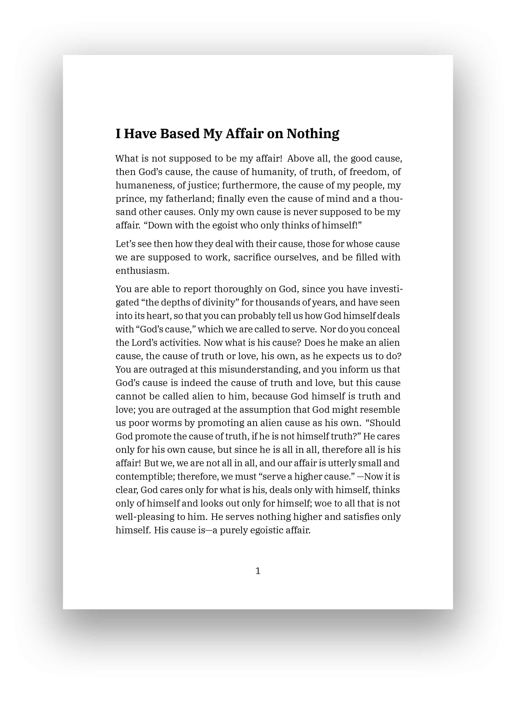

# 📝 Pandoc ConTeXt templates

[Pandoc](https://pandoc.org/) templates I use for producing nice-looking PDF writings. These templates use powerful [ConTeXt](https://wiki.contextgarden.net/Main_Page) macro package.

<p align="center">
  
</p>

## Prerequisities

- TeX distribution
- IBM Plex font family (IMB Plex Serif, IMB Plex Sans, IMB Plex Mono)

## Installation

See [Pandoc documentation](https://pandoc.org/MANUAL.html#templates) to see how to install and use templates.

1. Download template of choice from `src` directory.
2. Put template into `DATA_DIR/templates` (eg. `~/.pandoc/templates`)

## Usage

```sh
pandoc text.md -o text.pdf -t context --template=custom
```
